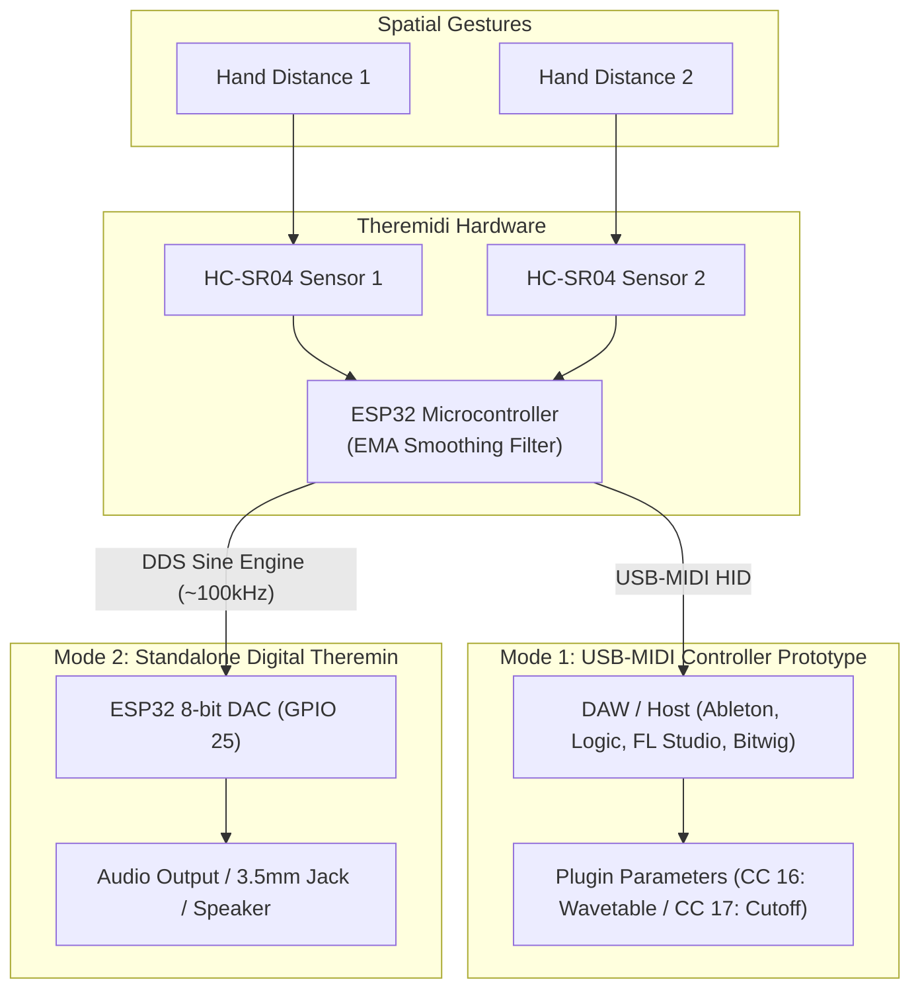

# 🎛️ Theremidi

### *Contactless MIDI Parameter Controller & Standalone Digital Instrument (DIY Prototype)*

[](LICENSE)
[](https://www.espressif.com/)
[](https://www.midi.org/)
[](hardware/3D%20Printable%20Files/)

> [!NOTE]
> **Project Status: Open-Source DIY Prototype & Experimental Platform**  
> Theremidi is an **experimental proof-of-concept and DIY prototype**, not a turnkey or studio-ready production product. It provides a functional, low-cost starting point for exploring contactless musical interaction. Musicians, sound designers, and creative coders are encouraged to build, experiment with, and evolve the hardware and DSP algorithms into custom studio instruments or live controllers as they see fit.

**Theremidi** explores the intersection between the expressive, physical gesture of acoustic performance and digital music production. Inspired by Léon Theremin’s legendary 1920 invention, Theremidi investigates replacing mechanical knobs and faders with **spatial gesture control**.

By tracking hand proximity using ultrasonic sensing and an experimental smoothing algorithm, Theremidi offers an accessible DIY platform to experiment with organic, tactile-free parameter modulation in DAWs, software synths, or standalone audio experiments.

---

## 📂 Repository Structure

```text
Theremidi/
├── firmware/
│   ├── usb_midi_controller/
│   │   └── usb_midi_controller.ino        # ESP32 Native USB-MIDI controller sketch
│   ├── standalone_synth_esp32/
│   │   └── standalone_synth_esp32.ino     # ESP32 DDS sine audio generator via DAC
│   ├── standalone_sensor_arduino/
│   │   └── standalone_sensor_arduino.ino  # Arduino Uno dual-sensor UART streamer
│   └── arduino_sensor_simulation/
│       └── arduino_sensor_simulation.ino  # Bench-testing / sensor simulation sketch
├── hardware/
│   └── 3D Printable Files/
│       ├── base.stl                       # Enclosure lower chassis
│       ├── lid.stl                        # Top faceplate with sensor cutouts
│       └── connector.stl                  # Internal mounting brackets
├── README.md                              # Project documentation, BOM & DAW guide
└── LICENSE                                # MIT License
```

---

## 🌟 Expressive Exploration: The Touchless Concept

Most MIDI controllers rely on mechanical faders, rotary knobs, or touch strips. Theremidi explores how **touchless spatial gestures** can inspire new creative workflows:

- **🌊 Organic Filter Sweeps & Reverb Swells**: Shape synth cutoffs, resonance, and ambient wet/dry mixes naturally through air gestures.
- **✨ Dynamic Wavetable & Granular Morphing**: Scrub through wavetable indexes or modulate granular scatter positions in plugins like Serum, Vital, Arturia Pigments, and Massive.
- **🎸 Touchless Performance Modulation**: Modulate effects while keeping your hands largely focused on playing an instrument, keyboard, or drum pad.
- **⚡ Jitter Reduction via Smoothing Filter**: Implements real-time **Exponential Moving Average (EMA)** filtering to tame noisy ultrasonic sensor readings and deliver smoother parameter sweeps.
- **🔌 Class-Compliant USB-MIDI (ESP32-S2/S3)**: Connects directly over USB without requiring custom drivers on macOS, Windows, Linux, or iPadOS.

---

## 🕹️ Two Operational Modes



### 1. 🎚️ Software Mode — Contactless USB-MIDI Controller
*Firmware: [`firmware/usb_midi_controller/usb_midi_controller.ino`](firmware/usb_midi_controller/usb_midi_controller.ino)*

The ESP32 registers as a native USB-MIDI Human Interface Device (HID). It translates physical proximity into MIDI Continuous Controller (CC) messages:
- **CC 16**: Mapped to parameter 16 (e.g., Wavetable Position / Reverb Depth, 5 cm – 40 cm range).
- **CC 17**: Mapped to parameter 17 (e.g., Filter Cutoff / FM Modulation Amount, 5 cm – 40 cm range).
- **Smoothing Filter**: Ultrasonic sensors inherently produce noise and micro-reflections. Theremidi applies an inline low-pass EMA filter:
  $$S_t = \alpha \cdot X_t + (1 - \alpha) \cdot S_{t-1} \quad (\alpha = 0.1)$$
  This significantly reduces sensor chatter and produces smoother MIDI automation.

### 2. 🎻 Hardware Mode — Standalone Digital Instrument
*Firmware: [`firmware/standalone_sensor_arduino/standalone_sensor_arduino.ino`](firmware/standalone_sensor_arduino/standalone_sensor_arduino.ino) + [`firmware/standalone_synth_esp32/standalone_synth_esp32.ino`](firmware/standalone_synth_esp32/standalone_synth_esp32.ino)*

A standalone prototype requiring no computer:
- **Dual-MCU Pipeline**: An Arduino Uno reads sensor pulses and streams coordinate packets over UART to an ESP32.
- **Direct Digital Synthesis (DDS)**: The ESP32 synthesizes a real-time sine wave updated at ~100 kHz (10 µs cycle).
- **Direct Analog Audio**: Pitch (100 Hz – 1000 Hz) and volume (0 – 255) are converted into an analog waveform via the ESP32’s onboard 8-bit hardware DAC (GPIO 25).

---

## 📋 Bill of Materials (BOM)

This Bill of Materials outlines all 3D printed mechanicals, hardware fasteners, and electronic components required to build the Theremidi prototype.

### 1. 3D Printed Enclosure Parts
Designed as an experimental desktop enclosure. STL files are available in [`hardware/3D Printable Files/`](hardware/3D%20Printable%20Files/):

| File | Quantity | Description | Print Recommendations |
| :--- | :---: | :--- | :--- |
| [`base.stl`](hardware/3D%20Printable%20Files/base.stl) | **1x** | Main chassis housing microcontroller and wiring | PLA / PETG, 0.2mm layer, 20% infill |
| [`lid.stl`](hardware/3D%20Printable%20Files/lid.stl) | **1x** | Top cover plate with dual ultrasonic sensor cutouts | PLA / PETG, 0.2mm layer, 20% infill |
| [`connector.stl`](hardware/3D%20Printable%20Files/connector.stl) | **2x** | Internal structural mounting brackets | PLA / PETG, 0.2mm layer, 30% infill |

### 2. Fasteners & Mechanical Hardware
| Item | Spec | Quantity | Usage |
| :--- | :--- | :---: | :--- |
| **Machine Screws** | **M3 × 5mm** (Socket or button head) | **4x** | Secures the top lid and internal bracket assemblies |
| **Rubber Feet** | 8mm–10mm bumpons *(optional)* | 4x | Non-slip feet for desktop stability |

### 3. Electronic Components
| Item | Recommended Model | Qty | Target Configuration |
| :--- | :--- | :---: | :--- |
| **Microcontroller (USB-MIDI Mode)** | **ESP32-S2** or **ESP32-S3** Dev Board | 1x | Mode 1: Requires Native USB support for MIDI HID |
| **Microcontroller (Audio Synth Mode)**| **ESP32-WROOM-32** + **Arduino Uno** | 1x ea | Mode 2: ESP32 with hardware DAC (GPIO 25) |
| **Sensors** | **HC-SR04P** (3.3V) or **HC-SR04** (5V) | 2x | Ultrasonic distance sensing for Pitch & Mod |
| **Resistors (Voltage Divider)** | 1kΩ and 2kΩ | 2 pr | Needed only when connecting 5V HC-SR04 Echo to 3.3V ESP32 |
| **Audio Output** | 3.5mm TRS jack + 10µF capacitor | 1x | Mode 2: Analog line output |
| **Audio Amp & Speaker** *(Optional)* | PAM8403 3W amp + 4Ω 3W speaker | 1x | Mode 2: Optional portable sound |
| **Cabling** | USB Data Cable (USB-C or Micro-USB) | 1x | Power and USB-MIDI data |
| **Wiring** | Breadboard or prototyping perfboard + jumpers | 1x | Internal wiring and assembly |

### 4. Assembly & Prototyping Notes
- **Tools**: A 2.0mm / 2.5mm hex driver for M3 screws.
- **Wiring**: For bench experimentation, a solderless breadboard and Dupont jumper wires are sufficient. For a sturdy, travel-friendly build inside the enclosure, perfboard soldering is recommended.

---

## ⚡ Pinout & Wiring Diagrams

### Mode 1: ESP32 Native USB-MIDI Controller
Connect the two HC-SR04 sensors to the ESP32:

| Sensor | Sensor Pin | ESP32 GPIO | Description |
| :--- | :--- | :--- | :--- |
| **Sensor 1 (Wavetable / CC 16)** | **VCC** | 5V / 3.3V | Power supply |
| | **GND** | GND | Ground |
| | **Trig** | **GPIO 26** | Pulse Trigger Output |
| | **Echo** | **GPIO 25** | Echo Return Input *(Use 1k/2k divider if 5V)* |
| **Sensor 2 (Cutoff / CC 17)** | **VCC** | 5V / 3.3V | Power supply |
| | **GND** | GND | Ground |
| | **Trig** | **GPIO 33** | Pulse Trigger Output |
| | **Echo** | **GPIO 32** | Echo Return Input *(Use 1k/2k divider if 5V)* |

> [!TIP]
> When using standard 5V HC-SR04 sensors with a 3.3V ESP32, feed the `Echo` pin through a simple resistor divider ($1\text{k}\Omega$ in series, $2\text{k}\Omega$ to GND) to bring the $5\text{V}$ echo signal safely down to $\approx 3.3\text{V}$.

---

### Mode 2: Standalone Synth (Arduino + ESP32 DAC)
1. **Arduino Uno**:
   - Sensor 1 (Pitch): Trig $\rightarrow$ Pin 2, Echo $\rightarrow$ Pin 3
   - Sensor 2 (Volume): Trig $\rightarrow$ Pin 4, Echo $\rightarrow$ Pin 5
   - Arduino TX (Pin 1) $\rightarrow$ ESP32 RX2 (**GPIO 16**) *(Ensure common GND)*
2. **ESP32 Audio Out**:
   - DAC Audio Signal: **GPIO 25** $\rightarrow$ (+) of $10\mu\text{F}$ capacitor $\rightarrow$ 3.5mm Audio Tip
   - Audio Ground: ESP32 GND $\rightarrow$ 3.5mm Audio Sleeve

---

## 🎚️ Quickstart: DAW Setup & MIDI Mapping

Once flashed, plug the ESP32 into your computer via USB:

- **Ableton Live**: Go to **Settings > MIDI**, find the MIDI device, and turn on **Track** and **Remote**. Enter MIDI Map mode (`Cmd/Ctrl + M`), click a parameter, wave your hand over Sensor 1 or 2, and exit MIDI map mode.
- **Logic Pro**: Press `Cmd + L` to open Controller Assignments. Click the desired parameter in your synth/plugin, wave your hand over the sensor to capture the incoming CC, and close the assignment window.
- **FL Studio**: Right-click any plugin knob, select **Link to Controller**, move your hand over a sensor, and FL Studio will auto-bind the control.
- **Bitwig Studio / Studio One / Reaper**: Native MIDI Learn functions detect CC 16 & CC 17 broadcasts directly.

---

## 🚀 Future Roadmap & Maker Ideas

There is plenty of room for creative technologists and musicians to take this project further:
- [ ] **Advanced Gesture Vocabulary**: Detect gesture speed, velocity, or dual-hand gestures to trigger additional CC parameters or note-on triggers.
- [ ] **High-Fidelity Audio (I2S DAC)**: Incorporate I2S audio chips (e.g., MAX98357A or PCM5102A) for cleaner audio output in standalone mode.
- [ ] **Wireless MIDI (BLE-MIDI)**: Implement Bluetooth Low Energy MIDI for wireless, battery-operated performance.
- [ ] **Web-MIDI Calibration Tool**: Create a lightweight browser tool using the Web-MIDI API to calibrate distances, set response curves, and remap CC numbers.
- [ ] **Alternative Sensors**: Experiment with Time-of-Flight (ToF / VL53L0X) optical sensors or infrared proximity sensors for tighter cones of detection.

---

## 🤝 Contributing & Community

Whether you're improving the smoothing filter, designing better 3D enclosures, or adapting it for a specific live rig, contributions and forks are welcome!
1. Fork the Project (`https://github.com/sanisapatrikar/Theremidi`)
2. Create your Feature Branch (`git checkout -b feature/NewGesture`)
3. Commit your Changes (`git commit -m 'Add new gesture feature'`)
4. Push to the Branch (`git push origin feature/NewGesture`)
5. Open a Pull Request

---

## 📄 License

Distributed under the MIT License. See `LICENSE` for more information.
