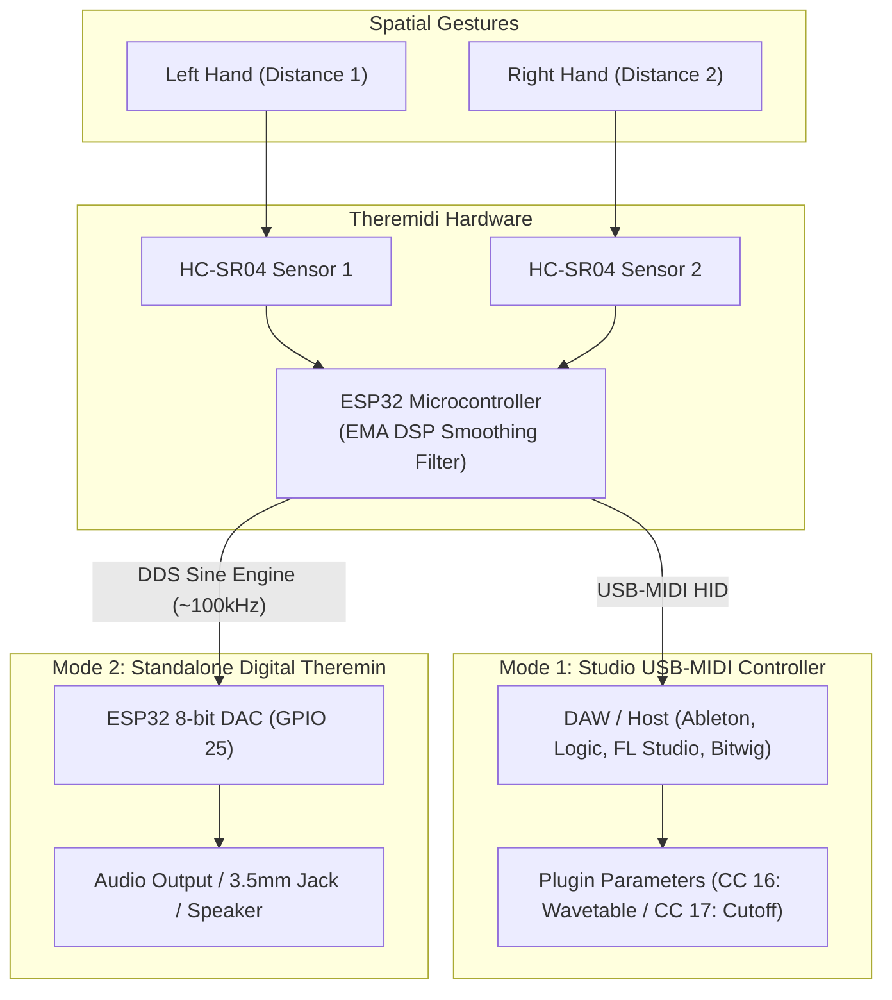

# 🎛️ Theremidi

### *Contactless MIDI Parameter Controller & Standalone Digital Instrument*

[](LICENSE)
[](https://www.espressif.com/)
[](https://www.midi.org/)
[](3D%20Printable%20Files/)

**Theremidi** bridges the gap between the expressive, physical intimacy of acoustic performance and the precision of modern digital music production. Inspired by Léon Theremin’s legendary 1920 invention, Theremidi replaces rigid knobs, faders, and touchscreens with **spatial gesture control**.

By tracking hand proximity in real time using ultrasonic sensing and a custom low-latency smoothing algorithm, Theremidi delivers continuous, organic, tactile-free parameter manipulation for your DAW, synthesizers, and live stage setups.

---

## 🌟 Why Theremidi for Music Production & Live Performance?

Traditional MIDI controllers rely on mechanical faders, rotary knobs, or touch strips. While precise, they can feel static and restrict natural musical gestures. Theremidi introduces **three-dimensional physical expression**:

- **🌊 Organic Filter Sweeps & Reverb Swells**: Shape synth cutoffs, resonance, and ambient wet/dry mixes naturally through air gestures.
- **✨ Dynamic Wavetable & Granular Morphing**: Scrub through wavetable indexes or modulate granular scatter positions in plugins like Xfer Serum, Vital, Arturia Pigments, and Native Instruments Massive.
- **🎸 Touchless Live Performance**: Wave a hand or instrument neck over the sensors to trigger dramatic breakdowns and drops without taking your hands off a keyboard, guitar, or drum machine.
- **⚡ Jitter-Free Analog Feel**: Built-in real-time **Exponential Moving Average (EMA)** DSP eliminates ultrasonic sensor flutter, delivering buttery-smooth 14-bit-like continuous parameter sweeps without stepping.
- **🔌 Plug-and-Play Class-Compliant USB-MIDI**: No third-party drivers or bridge software required. Recognised instantly across macOS, Windows, Linux, and iOS/iPadOS.

---

## 🕹️ Two Operational Modes



### 1. 🎚️ Software Mode — Contactless USB-MIDI Controller
*Firmware: [`software_version_w_smoothening_algo.ino`](software_version_w_smoothening_algo.ino)*

The ESP32 registers as a native USB-MIDI Human Interface Device (HID). It translates your physical proximity into high-resolution MIDI Continuous Controller (CC) messages:
- **CC 16**: Pre-mapped to **Wavetable Position / Reverb Depth** (5 cm – 40 cm range).
- **CC 17**: Pre-mapped to **Filter Cutoff / FM Modulation Amount** (5 cm – 40 cm range).
- **Custom Smoothing Engine**: Ultrasonic sensors can suffer from micro-reflections. Theremidi applies an inline low-pass EMA filter:
  $$S_t = \alpha \cdot X_t + (1 - \alpha) \cdot S_{t-1} \quad (\alpha = 0.1)$$
  This guarantees studio-grade, glitch-free automation curves in any DAW.

### 2. 🎻 Hardware Mode — Standalone Digital Instrument
*Firmware: [`theremin_arduino_code.ino`](theremin_arduino_code.ino) + [`theremin_esp_code.ino`](theremin_esp_code.ino)*

A self-contained digital instrument requiring zero computers or external software:
- **Dual-MCU Pipeline**: An Arduino Uno captures high-speed sensor pulses and streams coordinate packets over UART to an ESP32.
- **Direct Digital Synthesis (DDS)**: The ESP32 synthesizes a real-time sine wave updated at ~100 kHz (10 µs cycle).
- **Direct Analog Audio**: Pitch (100 Hz – 1000 Hz) and volume (0 – 255) are mapped and streamed directly to an audio output via the ESP32’s onboard 8-bit hardware DAC (GPIO 25).

---

## 📋 Bill of Materials (BOM)

A complete procurement and fabrication breakdown is documented in [**BOM.md**](BOM.md).

### 1. 3D Printed Enclosure Parts
Designed specifically for desk stability and optimal sensor acoustics. STL files are available in [`3D Printable Files/`](3D%20Printable%20Files/):

| File | Quantity | Description | Print Recommendations |
| :--- | :---: | :--- | :--- |
| [`base.stl`](3D%20Printable%20Files/base.stl) | **1x** | Main chassis housing microcontroller, wiring, and ports | PLA / PETG, 0.2mm layer, 20% infill |
| [`lid.stl`](3D%20Printable%20Files/lid.stl) | **1x** | Top cover plate with dual ultrasonic sensor cutouts | PLA / PETG, 0.2mm layer, 20% infill |
| [`connector.stl`](3D%20Printable%20Files/connector.stl) | **2x** | Structural assembly mounting clips / internal brackets | PLA / PETG, 0.2mm layer, 30% infill |

### 2. Fasteners & Mechanical Hardware
| Item | Spec | Quantity | Usage |
| :--- | :--- | :---: | :--- |
| **Machine Screws** | **M3 × 5mm** (Socket or button head) | **4x** | Secures the top lid and internal bracket assemblies |
| **Rubber Feet** | 8mm–10mm bumpons *(optional)* | 4x | Anti-slip desk pads for live studio stability |

### 3. Electronic Components
| Item | Recommended Model | Qty | Target Configuration |
| :--- | :--- | :---: | :--- |
| **Microcontroller (USB-MIDI Mode)** | **ESP32-S2** or **ESP32-S3** Dev Board | 1x | Mode 1: Requires Native USB support for MIDI HID |
| **Microcontroller (Audio Synth Mode)**| **ESP32-WROOM-32** + **Arduino Uno** | 1x ea | Mode 2: ESP32 with hardware DAC (GPIO 25) |
| **Sensors** | **HC-SR04P** (3.3V) or **HC-SR04** (5V) | 2x | Ultrasonic distance sensing for Pitch & Mod |
| **Resistors (Voltage Divider)** | 1kΩ and 2kΩ | 2 pr | Needed only when connecting 5V HC-SR04 Echo to 3.3V ESP32 |
| **Audio Output** | 3.5mm TRS stereo jack + 10µF capacitor | 1x | Mode 2: Analog audio output line-out |
| **Audio Amp & Speaker** *(Optional)* | PAM8403 3W amp + 4Ω 3W speaker | 1x | Mode 2: Portable standalone sound |
| **Cabling** | USB Data Cable (USB-C or Micro-USB) | 1x | Power and USB-MIDI data transmission |
| **Wiring** | Breadboard or prototyping perfboard + jumpers | 1x | Internal wiring and assembly |

---

## ⚡ Pinout & Wiring Diagrams

### Mode 1: ESP32 Native USB-MIDI Controller
Connect the two HC-SR04 sensors directly to the ESP32:

| Sensor | Sensor Pin | ESP32 GPIO | Description |
| :--- | :--- | :--- | :--- |
| **Sensor 1 (Wavetable / CC 16)** | **VCC** | 5V / 3.3V | Power supply |
| | **GND** | GND | Ground |
| | **Trig** | **GPIO 26** | Pulse Trigger Output |
| | **Echo** | **GPIO 25** | Echo Return Input *(Use 1k/2k divider if 5V)* |
| **Sensor 2 (Cutoff / CC 17)** | **VCC** | 5V / 3.3V | Power supply |
| | **GND** | GND | Ground |
| | **Trig** | **GPIO 33** | Pulse Trigger Output |
| | **Echo** | **GPIO 32** | Echo Return Input *(Use 1k/2k divider if 5V)* |

> [!TIP]
> When using standard 5V HC-SR04 sensors with a 3.3V ESP32, feed the `Echo` pin through a simple resistor divider ($1\text{k}\Omega$ in series, $2\text{k}\Omega$ to GND) to bring the $5\text{V}$ echo signal safely down to $\approx 3.3\text{V}$.

---

### Mode 2: Standalone Synth (Arduino + ESP32 DAC)
1. **Arduino Uno**:
   - Sensor 1 (Pitch): Trig $\rightarrow$ Pin 2, Echo $\rightarrow$ Pin 3
   - Sensor 2 (Volume): Trig $\rightarrow$ Pin 4, Echo $\rightarrow$ Pin 5
   - Arduino TX (Pin 1) $\rightarrow$ ESP32 RX2 (**GPIO 16**) *(Ensure common GND)*
2. **ESP32 Audio Out**:
   - DAC Audio Signal: **GPIO 25** $\rightarrow$ (+) of $10\mu\text{F}$ capacitor $\rightarrow$ 3.5mm Audio Tip
   - Audio Ground: ESP32 GND $\rightarrow$ 3.5mm Audio Sleeve

---

## 🎚️ Quickstart: DAW Integration & MIDI Mapping

Theremidi is class-compliant. Plug the USB cable into your computer, open your digital audio workstation, and start mapping:

```
[ Theremidi Device ] ---> (USB) ---> [ DAW MIDI Preferences: Enabled ]
                                              |
               +------------------------------+------------------------------+
               |                                                             |
      [ Ableton Live ]                                                [ Logic Pro ]
1. Enable 'Track' & 'Remote' in MIDI prefs.                    1. Press Cmd + L to open Controller Assignments.
2. Click 'MIDI' (top-right).                                   2. Click any plugin knob (e.g. Cutoff).
3. Click any knob/fader in your VST/AU.                        3. Wave your hand over Theremidi to auto-map!
4. Move your hand over Sensor 1 or 2 to map!
```

- **Ableton Live**: Go to **Settings > MIDI**, find `Theremidi / ESP32 MIDI`, and turn on **Track** and **Remote**. Hit `Cmd/Ctrl + M`, click any synth parameter, wave your hand over the sensor, and hit `Cmd/Ctrl + M` again.
- **Logic Pro**: Press `Cmd + L` to open Controller Assignments. Click the parameter you want to automate in your software synth, wave your hand to capture the CC message, and close the window.
- **FL Studio**: Right-click any plugin parameter, choose **Link to Controller**, move your hand over the sensor, and the link will automatically establish.
- **Bitwig Studio / Studio One / Reaper**: Native MIDI Learn works immediately with standard CC 16 & CC 17 broadcasts.

---

## 🚀 Future Roadmap & Audio Tech Innovations

We welcome contributions from musicians, embedded engineers, and creative technologists!
- [ ] **Multi-Gesture Engine**: Recognize wave speed, hold gestures, and dual-hand vertical offsets to expand control to 12+ simultaneous MIDI parameters.
- [ ] **High-Definition I2S DAC Support**: Add direct support for I2S audio chips (e.g., MAX98357A, PCM5102A) to output 24-bit / 96kHz studio-grade audio in standalone mode.
- [ ] **Bluetooth Low Energy (BLE-MIDI)**: Enable battery-powered wireless control for untethered stage presence with iOS/macOS/Windows devices.
- [ ] **Web-MIDI Calibration GUI**: Build a browser-based Web-MIDI app allowing users to adjust sensor min/max distances, smoothing factors, and custom CC output numbers without editing firmware.
- [ ] **Eurorack / CV-Gate Expansion**: Interface with analog modular synths via 0–10V Control Voltage outputs.

---

## 🤝 Contributing

Contributions make the open-source community thrive!
1. Fork the Project (`https://github.com/sanisapatrikar/Theremidi`)
2. Create your Feature Branch (`git checkout -b feature/ExpressionGesture`)
3. Commit your Changes (`git commit -m 'Add velocity-sensitive gesture detection'`)
4. Push to the Branch (`git push origin feature/ExpressionGesture`)
5. Open a Pull Request

---

## 📄 License

Distributed under the MIT License. See `LICENSE` for more information.
